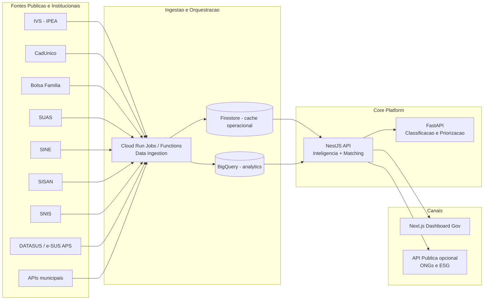
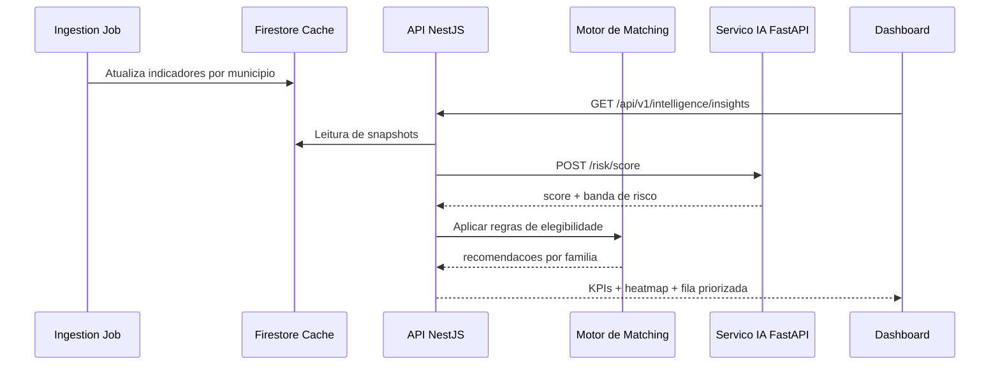

# InfraPulse Social - Arquitetura

## Princípios

- Nao substituir sistemas governamentais existentes.
- Integrar dados publicos e institucionais por conectores.
- Separar operacao transacional (Firestore) de analise (BigQuery).
- Entregar inteligencia acionavel com explainability basica.

## Visao de Componentes

## Fluxo de Inteligencia

## Mapeamento de Integracoes Obrigatorias

- IVS (IPEA): base principal de vulnerabilidade territorial.
- CadUnico / Bolsa Familia / SUAS: elegibilidade e acompanhamento social.
- SINE / Ministerio do Trabalho: matching emprego-renda.
- SISAN + bancos municipais: seguranca alimentar.
- SNIS + APIs municipais: saneamento e infraestrutura.
- DATASUS + e-SUS APS: correlacao saude-vulnerabilidade.

## Deploy em GCP

- Backend NestJS: Cloud Run service.
- Frontend Next.js: Cloud Run service (ou Firebase Hosting + SSR).
- Jobs ETL: Cloud Run Jobs agendado por Cloud Scheduler.
- Firestore: cache operacional com TTL e versionamento de snapshot.
- BigQuery: datasets historicos para BI e auditoria.

## Escalabilidade para outros estados

- Estrategia multi-tenant por UF e municipio.
- Conectores orientados a interface para adicionar novas fontes.
- Contratos de API estaveis (versionamento em /v1, /v2).
- Governanca LGPD com minimizacao e trilha de auditoria.
